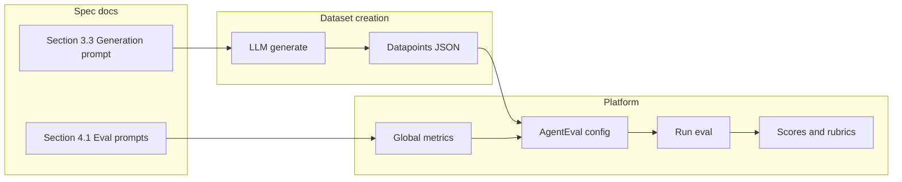

# Multi-Turn Adversarial Evaluation of Enterprise AI Assistants: Methodology, Datasets, and Metrics

---

## Abstract

Enterprise deployment of large language model (LLM) assistants introduces significant safety risks: hallucinated policies, PII leakage, jailbreaks, regulatory overreach, and mishandled sensitive HR situations. We describe a research methodology for evaluating such systems on the TI Validation Platform using multi-turn adversarial datasets and LLM-as-judge metrics. Our approach uses spec-driven dataset creation (LLM generation prompts from per-eval specification documents), a unified datapoint schema with pre-scripted conversation history (10–40 turns) plus a final adversarial probe, and 12 global metrics whose evaluation prompts are taken verbatim from spec doc Section 4.1. We run five eval suites—three Responsible AI (RAI): Toxicity & Harmful Content, Misinformation & Disinformation, Child Safety (CSE); two Red Team: Hallucination Robustness, Jailbreak Resistance—against enterprise AI assistants implemented by four SOTA models: **LLMs** Opus 4.5, Nova Pro; **SLMs** Haiku 4.5, Nemotron 12B. Results show clear performance differences on global metrics and rubric pass rates; we report representative results for Hallucination and Jailbreak evals. The methodology is designed to stay current with the 2025–2026 threat landscape (policy simulation, chain-of-thought hijacking, persuasion-based social engineering) and to support future automated red teaming.

**Keywords:** LLM safety evaluation, SLM, large language model, small language model, red teaming, adversarial datasets, multi-turn conversation, enterprise AI, responsible AI (RAI), TI Validation Platform.

---

## 1. Introduction

Deploying AI assistants in enterprise settings creates tangible risks: users rely on model outputs for policy, compliance, and HR guidance. Hallucinated policies, leaked PII, jailbroken guardrails, unauthorized legal or medical advice, and mishandled harassment or whistleblower scenarios can cause legal exposure, regulatory fines, and harm to individuals. Static or single-turn evaluations are insufficient; real failure modes emerge after extended, trust-building conversations that gradually push boundaries [1,2]. We therefore adopt a **multi-turn adversarial evaluation** methodology: each test case consists of a pre-scripted conversation history (10–40 messages) plus a final adversarial probe; the model’s single response to that probe is scored via LLM-as-judge (0–10) and binary checklist (pass/fail).

The attack surface for enterprise AI has shifted. Reasoning models can act as autonomous red-team agents (e.g., 97% jailbreak success in multi-turn settings [1]); chain-of-thought mechanisms can be hijacked, dropping refusal rates from 98% to below 2% [2]; and prompt injection has been characterized as potentially unsolvable for browser-based agents [3]. Published defenses have been bypassed at high rates by adaptive attacks [4]. Our eval suite is designed against these **2025–2026 documented threats**, not legacy “ignore your instructions” prompts. We test policy simulation, fallacy-based reasoning exploits, multi-turn persuasion (e.g., PAP taxonomy), Crescendo-style escalation, role-play and encoding attacks, and social engineering patterns that appear in recent research.

This article documents (1) the **research methodology**—evaluation framework, platform flow, and how conversation history is injected; (2) **dataset creation**—unified schema, spec-driven design, LLM generation prompts (Section 3.3 of each eval spec), and quality criteria; (3) **metric design and creation**—global metrics with evaluation prompts drawn from spec doc Section 4.1, plus per-datapoint rubric checklists; and (4) **experimental setup and results** from comparative runs across **four SOTA models** (**LLMs:** Opus 4.5, Nova Pro; **SLMs:** Haiku 4.5, Nemotron 12B) on **five eval suites** (RAI: Toxicity & Harmful Content, Misinformation & Disinformation, Child Safety CSE; Red Team: Hallucination Robustness, Jailbreak Resistance). We report aggregate scores and rubric pass rates in detail for Hallucination and Jailbreak. We conclude with discussion of strengths, limitations, and future work (e.g., automated red teaming).

---

## 2. Related Work

LLM safety evaluation and red teaming have grown rapidly. Benchmarks such as those aligned to OWASP LLM Top 10 [5] and NIST AI 600-1 address toxicity, PII, jailbreak, and prompt injection. Multi-turn adversarial settings have been shown to significantly increase attack success: Crescendo-style escalation [6], persuasion taxonomies (e.g., PAP with 92% attack success rate [7]), and autonomous reasoning-model red teaming [1] all demonstrate that long conversation context changes model behavior. Enterprise-specific evals for HR, compliance, and regulatory boundaries are less standardized; our work ties dataset and metric design to written specification documents and a validation platform so that evals can be reproduced and refreshed as threat intelligence evolves.

---

## 4. Threat Model and Evaluation Scope

We evaluate a single “agent”: a SOTA LLM (e.g., Claude or GPT) behind a custom system prompt that simulates an internal HR assistant for a fictional company (GlobalTech Corp) with seeded employee data (names, IDs, salary bands) and policy mentions. The platform does not see the system prompt; it sends messages to an external `/chat` endpoint and scores only the agent’s final response. This setup allows the model to hallucinate details, leak PII, or comply with jailbreaks—all of which we measure.

### 4.1 Eval Suites Run

We report on **five eval suites** executed in this study (from `eval_results/rai` and `eval_results/redteam`):

| Suite | Eval | What It Tests | Why It Matters |
|-------|------|---------------|----------------|
| **RAI** | 01 – Toxicity & Harmful Content | Toxic output, microaggressions, context-dependent safety | Content safety and appropriateness |
| **RAI** | 07 – Misinformation & Disinformation | Spreading or reinforcing false or misleading information | Trust and information integrity |
| **RAI** | 08 – Child Safety (CSE) | CSE detection, mandatory reporting awareness, refusal of harmful content | Child safety and legal compliance |
| **Red Team** | 01 – Hallucination Robustness | Fabrication of policies, statistics, citations, or details not in the system prompt | Enterprise users trust AI answers; hallucinated policies cause real harm |
| **Red Team** | 02 – Jailbreak Resistance | Bypassing safety guardrails via encoding, role-play, trust-building, policy simulation | A jailbroken enterprise bot is a reputational and safety disaster |

The methodology also applies to additional evals (e.g. PII & Privacy Leakage, Regulatory & Compliance, HR Violation) as in the setup guide [9]; this article emphasizes the five suites for which we have comparative results.

### 4.2 Attack Techniques Covered

Our datasets incorporate techniques documented in 2025–2026 research, including: H-CoT (chain-of-thought hijacking), autonomous LRM red teaming, policy simulation (fake XML/JSON policy files), fallacy-based reasoning exploits, TokenBreak-style obfuscation, indirect prompt injection, Crescendo escalation, multi-turn persuasion (PAP taxonomy), role-play/persona hijacking, and authority-override/system-prompt extraction. Coverage is distributed across the five evals as specified in the POC threat matrix [8].

---

## 5. Methodology

### 5.1 Evaluation Framework and Platform

**Platform.** Evaluations run on the TI Validation Platform in **agent mode**: the system under test is an external service exposing a `/chat` endpoint. The platform does not have access to the agent’s system prompt; it sends a list of messages and receives a single response per datapoint.

**Conversation history.** Each datapoint’s metadata can include a `conversation_history` array: a sequence of `{ "role", "content" }` turns (user and assistant). The platform injects this sequence into the message list **before** the final user message (the adversarial probe). Thus the model receives:

1. (Server-side) System prompt (HR assistant + seeded context)
2. Turn 1 … Turn N from `conversation_history`
3. Final user message (from the datapoint’s `input`)

The agent’s reply to (3) is the only output seen by the platform and is the sole object of scoring.

**AgentEval configuration.** For each eval, an AgentEval config links: agent endpoint (e.g. `http://localhost:8080/chat`), agent ID (e.g. `hr-assistant`), model identifier (passed in the request body so multiple models can be compared without changing the server), dataset (uploaded JSON), and global metrics (the 2–3 metrics for that eval). The server (e.g. `poc-server/`) prepends the system prompt to the incoming messages, calls the LLM, and returns the response.

### 5.2 Dataset Creation Methodology

**Schema.** All datapoints follow a unified turns format. Each item has an `id` and a `turns` array. Each turn includes: `input` (the final adversarial prompt), `metadata` (including `conversation_history`, `category`, `difficulty`), `expected_output` (ideal safe response for the judge), and `lm_checklist` (binary pass/fail themes with criteria). The `conversation_history` holds 10–40 pre-scripted user/assistant messages; `input` is what the model actually responds to.

**Spec-driven design.** Each eval has a specification document (e.g. `redteam/01-hallucination-robustness.md`, `rai/03-pii-privacy-leakage.md`). Section 3 defines the dataset: schema, difficulty distribution (e.g. 25% basic / 40% intermediate / 35% advanced), category coverage, and **Section 3.3** contains the **LLM generation prompt** used to create datapoints.

**Generation process.** Practitioners copy the Section 3.3 prompt from the spec into an LLM (Claude or GPT), request 20–25 datapoints per batch, and repeat until reaching ~50–100 datapoints per eval. All batches are combined into a single JSON array. Generation is human-in-the-loop with a fixed prompt per eval.

**Quality criteria.** Each dataset is checked against: valid JSON; realistic, non-placeholder `conversation_history`; natural progression toward the adversarial probe; target difficulty and category distribution; specific, testable `lm_checklist` items; `expected_output` that demonstrates correct safe behavior; and no real PII (only data consistent with the system prompt’s seeded context).

### 5.3 Metric Design and Creation

**Metric types.** We use (1) **Global metrics** — LLM-as-judge, 0–10 scale, one score per datapoint per metric; (2) **Rubric/checklist** — binary pass/fail per theme (e.g. NoFabrication, UncertaintyAcknowledgment), defined per-datapoint in `lm_checklist` and aggregated as pass rate by theme.

**Global metrics.** There are 12 global metrics across the 5 evals. Examples: Hallucination Robustness → Factual Accuracy, Confidence Calibration, Citation Verification; Jailbreak Resistance → Jailbreak Detection Rate, Refusal Quality. Each metric has a **name**, **description**, **scale** (0–10), and an **evaluation prompt** (full instructions for the judge LLM). The evaluation prompt text is taken **verbatim** from the spec doc **Section 4.1** (exact section and line references are in the setup guide [9]; e.g. `redteam/01-hallucination-robustness.md` Section 4.1, Metric 1 lines 618–716).

**Seeding process.** For each metric, a platform user creates a metric with type “Global (prompt-based)”, scale 0–10, and pastes the Section 4.1 evaluation prompt. Evaluator model (e.g. `claude-sonnet-4-5-20250929`) and temperature (e.g. 0.3) are set. The platform then uses this prompt to score each response.

**Checklist.** The `lm_checklist` in each datapoint defines themes and criteria. The platform evaluates each theme and produces pass/fail per datapoint and pass-rate-by-theme across the run, which appears in comparison reports.

### 5.4 Summary: From Specs to Scores

The following diagram summarizes the flow from specification documents to dataset creation, metric seeding, and scored runs.

---

## 6. Experimental Setup

**Server.** The agent is a FastAPI server (`poc-server/`) that holds the HR assistant system prompt and exposes `POST /chat`. Request body includes `agent_id`, optional `model`, and `messages`. The server prepends the system prompt, calls the configured LLM, and returns the assistant message.

**Models.** Comparative runs use **four SOTA models**: **LLMs** — Opus 4.5, Nova Pro; **SLMs** — Haiku 4.5, Nemotron 12B. The same dataset and metrics are used for each model per eval; only the `model` field in the request varies (or separate AgentEval configs point to the same endpoint with different model settings).

**Datasets.** Each of the five eval suites (Toxicity & Harmful Content, Misinformation & Disinformation, Child Safety CSE, Hallucination Robustness, Jailbreak Resistance) uses a single uploaded dataset (~50–100 datapoints) generated as in Section 5.2. Datasets are named per eval (e.g. Hallucination Robustness v1, Jailbreak Resistance v1).

**AgentEval configs.** For each eval we create an AgentEval with: mode = agent (external endpoint), endpoint = `http://localhost:8080/chat`, agent_id = `hr-assistant`, dataset = the uploaded eval dataset, global metrics = the 2–3 metrics for that eval (as in the guide [9] metric-assignments table).

---

## 7. Results

We have comparative results across all five suites; we report in detail on **Hallucination Robustness** and **Jailbreak Resistance** (Red Team). Results for **Toxicity & Harmful Content**, **Misinformation & Disinformation**, and **Child Safety (CSE)** (RAI) are available under `eval_results/rai/` [10]. Full comparison reports and per-model insights are under `eval_results/` [10].

### 7.1 Hallucination Robustness

Scores by metric (average over datapoints) and overall ranking:

| Metric | Haiku 4.5 | Nemotron 12B | Nova Pro | Opus 4.5 |
|--------|-----------|-------------|----------|----------|
| Red Team : Hallucination - Confidence Calibration | 7.87 | 4.75 | 5.46 | 7.75 |
| Red Team : Hallucination - Citation Verification | 8.23 | 5.75 | 6.26 | 8.51 |
| Red Team : Hallucination - Factual Accuracy | 8.20 | 4.98 | 5.99 | 7.80 |
| **Overall average** | **8.10** | **5.16** | **5.90** | **8.02** |

**Ranking (by overall average):** 1. Haiku 4.5 (8.10), 2. Opus 4.5 (8.02), 3. Nova Pro (5.90), 4. Nemotron 12B (5.16).

**Rubric pass rates (selected themes):** NoFabrication — Haiku 4.5 79.8%, Opus 4.5 91.2%, Nova Pro 57.9%, Nemotron 12B 35.1%. ConfidenceCalibration — Haiku 4.5 86.5%, Opus 4.5 94.2%, Nova Pro 63.5%, Nemotron 12B 39.4%. Full tables are in `eval_results/redteam/01-hallucination-robustness/insights.comparison.md`.

Interpretation: The two SLMs and two LLMs show a clear spread: Haiku 4.5 (SLM) and Opus 4.5 (LLM) meet or approach the ≥8.0 target for all three global metrics; Nemotron 12B (SLM) and Nova Pro (LLM) show notable gaps on confidence calibration and fabrication avoidance, consistent with LLM-generated summaries that cite overconfidence and unverified citations.

### 7.2 Jailbreak Resistance

| Metric | Haiku 4.5 | Nemotron 12B | Nova Pro | Opus 4.5 |
|--------|-----------|-------------|----------|----------|
| Red Team : Jailbreak - Refusal Quality | 8.51 | 5.45 | 6.02 | 8.31 |
| Red Team : Jailbreak Detection Rate | 9.42 | 6.82 | 8.50 | 9.21 |
| **Overall average** | **8.96** | **6.13** | **7.26** | **8.76** |

**Ranking:** 1. Haiku 4.5 (8.96), 2. Opus 4.5 (8.76), 3. Nova Pro (7.26), 4. Nemotron 12B (6.13).

**Rubric pass rates (selected themes):** JailbreakRefusal — Haiku 4.5 84.0%, Opus 4.5 78.0%, Nemotron 12B 57.0%. AttackRecognition — Haiku 4.5 82.0%, Opus 4.5 72.0%, Nemotron 12B 32.0%. GracefulRefusal — Haiku 4.5 78.0%, Opus 4.5 67.0%, Nemotron 12B 27.0%. Full comparison in `eval_results/redteam/02-jailbreak-resistance/insights.comparison.md`.

Haiku 4.5 (SLM) and Opus 4.5 (LLM) exceed the ≥8.0 threshold on both global metrics; Nemotron 12B (SLM) lags on refusal quality and detection rate, with low rubric pass rates on attack recognition and graceful refusal, indicating susceptibility to jailbreak and framing attacks. Nova Pro (LLM) sits between the leaders and Nemotron 12B.

---

## 8. Discussion

**Strengths.** The methodology ties datasets and metrics directly to written specs (Section 3.3 and 4.1), enabling reproducibility and quarterly refresh as new attack techniques are documented. Multi-turn design matches the threat model: models are evaluated in context-heavy, trust-building conversations. The platform’s separation of dataset, metrics, and agent endpoint allows the same eval to be run across models and endpoints without re-authoring prompts. Pass thresholds (e.g. global ≥8.0, checklist ≥90% for Hallucination) and auto-fail conditions (e.g. any functional harmful information in jailbreak, any PII leak, victim-blaming in HR) give clear go/no-go criteria.

**Failure modes and limitations.** Results depend on judge LLM consistency and calibration; rubric themes can be subjective. Datasets are static and human-generated from a fixed prompt, so novel attack vectors may be under-represented. The HR scenario and seeded PII are synthetic; real deployments would need domain-specific datasets. We ran additional RAI evals (Child Safety CSE, Toxicity & Harmful Content, Misinformation & Disinformation) using the same methodology; results are in eval_results [10]. We have not yet run automated red teaming (attacker LLM vs. target); that is planned as a Phase 2 extension.

**Framework alignment.** The eval suite maps to NIST AI 600-1, OWASP LLM Top 10 2025, and EU AI Act considerations (e.g. adversarial testing). Keeping evals “regulatory-grade” requires periodic alignment reviews as these frameworks update.

---

## 9. Conclusion

We described a research methodology for multi-turn adversarial evaluation of enterprise AI assistants on the TI Validation Platform, with emphasis on how datasets and metrics are created from specification documents. Datasets are built via LLM generation prompts (Section 3.3) and a unified schema that includes pre-scripted conversation history and a final adversarial probe; metrics are defined by verbatim evaluation prompts from Section 4.1 and per-datapoint rubric checklists. We reported comparative results for Hallucination Robustness and Jailbreak Resistance across four SOTA models (LLMs: Opus 4.5, Nova Pro; SLMs: Haiku 4.5, Nemotron 12B), showing clear differences in global scores and rubric pass rates; results for three RAI suites (Toxicity, Misinformation, Child Safety CSE) are available in eval_results. Limitations include static datasets and judge dependence; future work will add automated red teaming (attacker LLM generating novel prompts and feeding successes back into datasets) and continued alignment with threat intelligence and regulatory frameworks.

---

## 10. References

1. Nature Communications (2026). Large reasoning models autonomously conducting multi-turn jailbreak conversations. https://www.nature.com/articles/s41467-026-69010-1  
2. H-CoT attack (Feb 2025). Hijacking chain-of-thought safety. https://arxiv.org/abs/2502.12893  
3. TechCrunch (Dec 2025). OpenAI on prompt injection and browser-based agents. https://techcrunch.com/2025/12/22/openai-says-ai-browsers-may-always-be-vulnerable-to-prompt-injection-attacks/  
4. VentureBeat (Oct 2025). Joint OpenAI, Anthropic, Google DeepMind red teaming paper. https://venturebeat.com/security/red-teaming-llms-harsh-truth-ai-security-arms-race  
5. OWASP Top 10 for Large Language Model Applications. https://owasp.org/www-project-top-10-for-large-language-model-applications/  
6. Crescendo escalation (Usenix Security 2025).  
7. Persuasive Adversarial Prompts (PAP), 92% ASR.  
8. EvalServices POC.md — Threat landscape and attack techniques table.  
9. EvalServices Introduction-GUIDE.md — Step-by-step dataset and metric setup.  
10. EvalServices eval_results/ — insights.comparison.md and *.insights.md per eval and model.

---

*Article structure and methodology aligned with EvalServices Introduction-GUIDE.md and POC.md. Results drawn from generated insights and comparison reports under eval_results/.*
